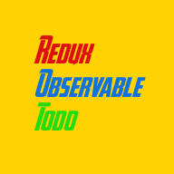

> This code is published as part of the corresponding blog article at the [Toptal Engineering Blog](https://www.toptal.com/react-native/react-redux-rxjs-tutorial)
>
> Visit https://www.toptal.com/blog and subscribe to our newsletter to read more great posts!

   
   
  
   
   

Redux Observable Todo
---------------------

Sample todo app using redux-observable
